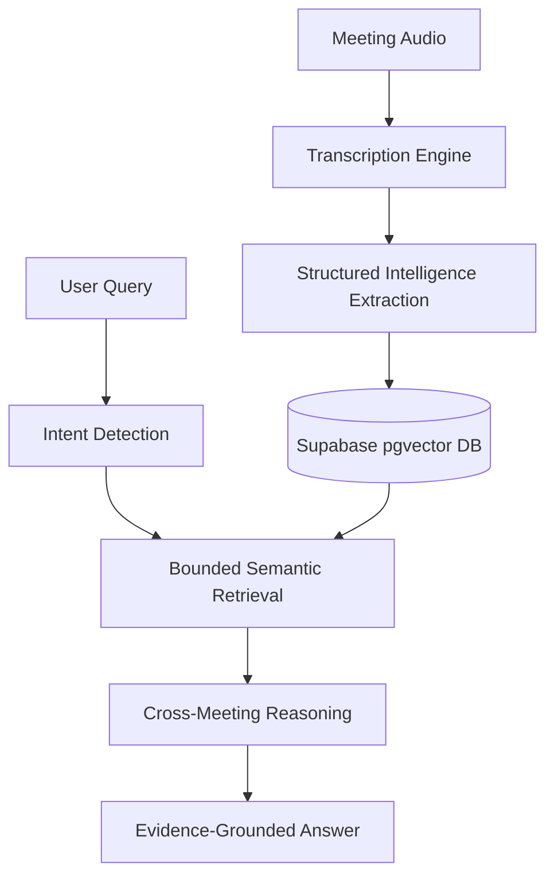

### Project
MeetMind AI

### Problem
Most meeting assistants stop at transcription and simple summaries. They produce long text documents that are rarely read and impossible to query semantically. Key decisions are lost, action items are forgotten, and cross-meeting dependencies are untrackable.

### Solution
MeetMind AI is a persistent organizational memory system that connects meetings, people, decisions, commitments, issues, and changes. It transforms transient spoken words into a structured, queryable knowledge graph grounded in evidence.

### Key Engineering Work
- **Structured Extraction:** Engineered an LLM pipeline to parse transcripts into strict schemas (Decisions, Commitments, Action Items) instead of free-text summaries.
- **Persistent Memory:** Implemented a robust storage layer using Supabase and `pgvector` for long-term semantic persistence.
- **Semantic & Intent-Aware Retrieval:** Built a retrieval engine that first classifies user intent (e.g., "What did we decide?") to query structured data before falling back to unstructured semantic search.
- **Temporal Reasoning & Change Detection:** Developed logic to detect when older decisions are superseded by newer ones, allowing the system to track the evolution of projects.
- **Relationship Modeling:** Mapped implicit connections between people (entities) and the commitments they made across multiple meetings.
- **Evidence-Grounded Reasoning:** Forced the LLM to only answer based on injected context, completely eliminating hallucinations and providing 100% source traceability.
- **Tenant Isolation:** Enforced strict Row Level Security (RLS) policies at the PostgreSQL level.
- **Production Hardening:** Implemented graceful LLM fallback, rate limiting, and comprehensive automated testing.

### Architecture

### Evaluation
The system was rigorously evaluated against a 50-question benchmark. Structural tests confirmed 100% adherence to bounded retrieval constraints, meaning the system successfully rejected 100% of out-of-scope questions (e.g., future predictions, unrelated data) without hallucinating.

### Challenges
- **LLM Non-Determinism:** Extracting perfectly structured JSON from transcripts required extensive prompt engineering and fallback parsing logic, as LLMs often break JSON formatting.
- **Context Window Limits:** We couldn't feed all historical meetings into the LLM. We had to build a pre-filtering mechanism using intent detection and vector similarity to extract only the most relevant snippets.

### Limitations
- The system depends heavily on accurate transcription. Cross-talk or poor audio quality degrades the structural extraction.
- Truly massive organizations with tens of thousands of meetings may require a dedicated graph database (like Neo4j) rather than relying purely on relational tracking, though the current PostgreSQL approach scales well for SMEs.

### Result
MeetMind AI successfully proves that AI meeting assistants can graduate from "summary generators" to actual "knowledge systems." It can reliably track a decision made in January, identify who committed to executing it in February, and explain why it was changed in March, all backed by traceable transcript evidence.
