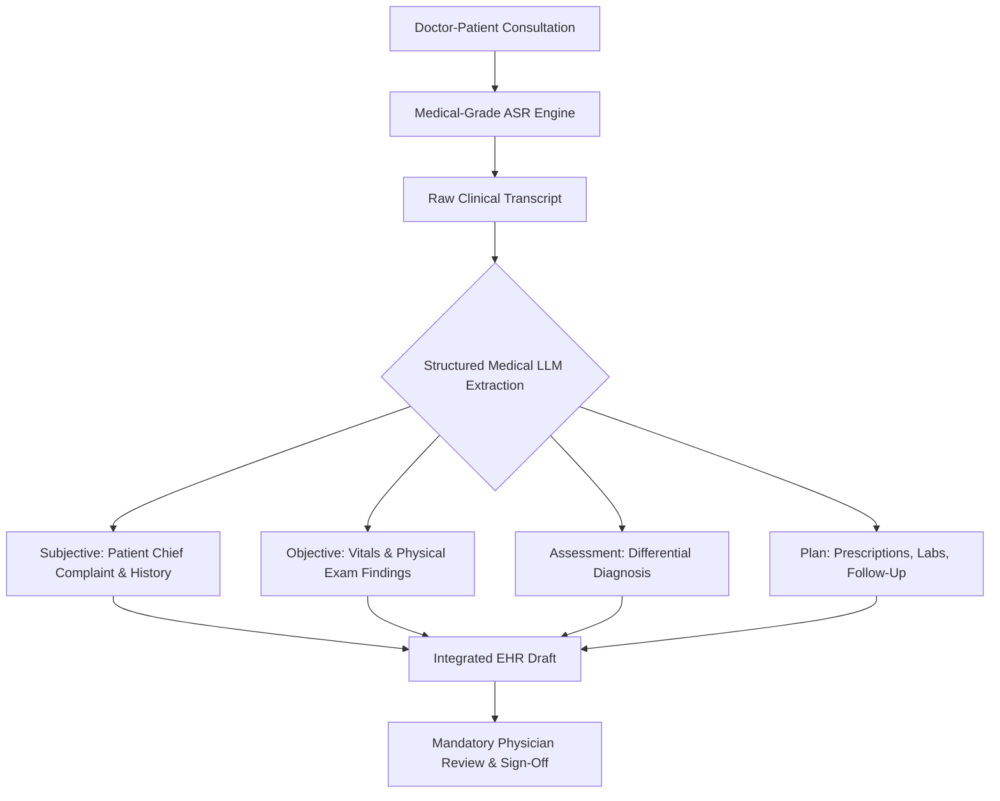

In modern healthcare, documentation burden is one of the leading drivers of clinician burnout. Studies published in the *Annals of Internal Medicine* indicate that for every hour physicians spend in direct clinical face time with patients, they spend nearly two additional hours updating Electronic Health Record (EHR) systems—often completing clerical documentation late into the evening ("pajama time").

Automated clinical transcription and ambient AI scribes have emerged as powerful tools to restore physician bandwidth. By capturing the natural conversation between a doctor and patient, speech-to-text models and generative LLMs can synthesize messy dialogue into structured medical documentation.

However, healthcare is a zero-fault operational domain. 

A speech-to-text model that mishears "hyperthyroid" as "hypothyroid" or hallucinates a medication dosage can directly compromise patient safety. Furthermore, handling Protected Health Information (PHI) in the United States requires strict adherence to the **HIPAA Security Rule**, formal **Business Associate Agreements (BAAs)**, and rigorous data residency controls.

This guide provides an engineering and regulatory breakdown of how AI transcription operates in clinical environments, how structured **SOAP notes** are generated, and the essential safety protocols required to deploy medical AI systems.

---

## 1. The Anatomy of Clinical SOAP Notes

The universal standard for clinical documentation is the **SOAP format** (Subjective, Objective, Assessment, Plan). Converting ambient clinical conversations into this structured schema requires multi-stage semantic extraction:



### Component Breakdown:
* **Subjective (S):** Information reported directly by the patient—chief complaint, history of present illness (HPI), symptom duration, and reported pain scales.
* **Objective (O):** Measurable, verifiable clinical data observed by the clinician—vital signs, diagnostic imaging results, and physical examination findings voiced aloud during the visit.
* **Assessment (A):** The clinician's diagnostic evaluation, synthesizing subjective complaints with objective findings into primary and differential diagnoses.
* **Plan (P):** The actionable treatment strategy—prescriptions, lab orders, surgical consultations, lifestyle modifications, and scheduled follow-up appointments.

#### Example Extraction Schema:
```json
{
  "encounter_type": "Outpatient Follow-up",
  "soap_note": {
    "subjective": "Patient reports persistent bilateral knee pain for 3 weeks, exacerbated by stair climbing. Denies fever or swelling.",
    "objective": "No joint effusion. Mild crepitus upon active flexion. Range of motion intact (0-130 degrees).",
    "assessment": "Early bilateral patellofemoral osteoarthritis.",
    "plan": [
      "Physical therapy 2x weekly for 6 weeks focusing on quadriceps strengthening",
      "Meloxicam 7.5mg daily with food as needed for inflammation",
      "Follow-up in clinic in 8 weeks if symptoms do not improve"
    ]
  }
}
```

---

## 2. Regulatory Compliance: HIPAA and Protected Health Information (PHI)

Under the US Health Insurance Portability and Accountability Act (HIPAA), voice recordings of doctor-patient encounters represent **Protected Health Information (PHI)**.

Deploying AI systems in clinical workflows requires three non-negotiable compliance pillars:

### A. Formal Business Associate Agreements (BAAs)
Under 45 CFR § 164.502(e), covered healthcare entities cannot transmit PHI to a software vendor unless a executed Business Associate Agreement (BAA) is in place. The BAA legally obligates the vendor to implement administrative, physical, and technical safeguards matching HIPAA standards.

> **Caution:** Standard consumer AI tools and developer APIs explicitly disclaim HIPAA liability unless you are operating under an enterprise contract with an executed BAA.

### B. The 18 HIPAA Safe Harbor De-Identification Identifiers
When routing clinical transcripts to external model inference clusters, automated preprocessing pipelines should redact all 18 HIPAA Safe Harbor identifiers:
1. Names
2. Geographic subdivisions smaller than a state
3. Dates directly related to an individual (birth, admission, discharge)
4. Phone numbers
5. Fax numbers
6. Email addresses
7. Social Security numbers
8. Medical record numbers (MRNs)
9. Health plan beneficiary numbers
10. Account numbers
11. Certificate/license numbers
12. Vehicle identifiers and serial numbers
13. Device identifiers and serial numbers
14. Web Universal Resource Locators (URLs)
15. Internet Protocol (IP) addresses
16. Biometric identifiers (fingerprints and voiceprints)
17. Full-face photographic images
18. Any other unique identifying number, characteristic, or code

---

## 3. Acoustic and Linguistic Challenges in Medical ASR

General-purpose speech-to-text models frequently degrade when exposed to clinical dialogue. Specialized medical ASR must overcome three primary acoustic hurdles:

### 1. Complex Pharmacological Terminology
Drug brand names and generic equivalents frequently share phonetic similarities while treating wildly different conditions (e.g., *Celebrex* vs. *Celexa*, or *Adderall* vs. *Inderal*). A general ASR model trained on YouTube or internet audio lacks the specialized medical priors needed to disambiguate pharmacological tokens.

### 2. Multi-Speaker Exam Room Acoustics
Unlike a clean remote video call where each participant wears a microphone, clinical encounters typically rely on a single smartphone or ambient microphone placed on a desk. The acoustic model must separate the physician's voice from the patient's voice, family members in the room, and background medical monitor beeps.

### 3. Rapid Code-Switching
Patients describe symptoms in colloquial terms (*"my stomach feels sour"*), while clinicians dictate findings in technical Latinate terminology (*"epigastric tenderness without rebound"*). The downstream language model must correlate colloquial patient phrases with standard medical terminology.

---

## 4. Architectural Comparison: Clinical Documentation Options

| Documentation Approach | Cost per Encounter | Turnaround Latency | Accuracy / Safety Profile | Physician Time Saved |
| :--- | :--- | :--- | :--- | :--- |
| **Traditional Medical Transcriptionist** | $12.00 to $25.00 per visit | 12 to 36 hours | High human accuracy; variable formatting | ~1.5 hours daily |
| **Legacy Voice Dictation (e.g. Dragon)** | $1,500+ / license / year | Instantaneous | Requires rigid voice commands; no ambient listening | ~30 minutes daily |
| **Ambient AI Scribes (ASR + LLM Pipeline)** | ~$0.10 to $0.50 per visit (API cost) | 30 to 90 seconds | High structural accuracy; requires mandatory physician sign-off | ~1.5 to 2 hours daily |

---

## 5. The Mandatory Human-in-the-Loop Safeguard

In healthcare applications, autonomous AI generation without clinician verification is medically irresponsible and legally indefensible.

```
AI Model Role = Administrative Drafter (Presents pre-populated SOAP draft)
Physician Role = Legal Attestor (Reviews, edits, and digitally signs record)
```

### Safety Protocols:
* **No Direct EHR Insertion Without Sign-off:** AI systems must stage notes in an editable review interface. The attending physician must affirmatively review and sign the note before it commits to the permanent patient record.
* **Transcript Source Anchoring:** Every medication dosage or allergy documented in the draft must link back to the exact audio timestamp in the consultation recording for instant verification.
* **Defensive Temperature Calibration:** Clinical summarization prompts must execute at low temperatures (0.1 to 0.2) with strict negative constraints prohibiting clinical extrapolation or speculative diagnoses.

---

## Conclusion

Automated clinical transcription represents one of the highest-leverage applications of artificial intelligence in modern society—relieving physician burnout and restoring the human connection to medicine. By enforcing strict HIPAA safeguards, executing BAAs, and anchoring all AI drafts to mandatory clinician sign-off, healthcare organizations can harness the speed of AI while upholding the highest standards of patient care.
