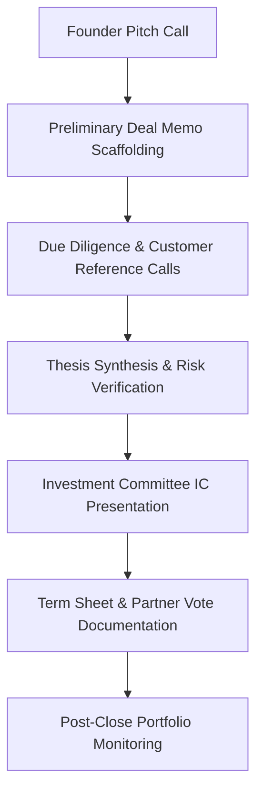

Venture capital is fundamentally an information asymmetry business. In early-stage and growth investing, a firm's performance relies on sourcing high-potential founders, conducting rigorous due diligence under extreme time compression, and deploying capital before competing syndicates preempt the round.

During an active deal market, an investment team—comprising partners, principals, and associates—typically conducts 20 to 40 founder pitches, customer reference checks, and expert network calls every single week.

Yet the operational substrate of most venture firms remains remarkably primitive. 

Associates take frantic handwritten notes or disjointed bullets in private Notion docs. Numerical claims made verbally by founders—such as monthly recurring revenue (MRR) trajectories, customer acquisition costs (CAC), and net revenue retention (NRR)—are often misremembered or lost entirely. 

When the Investment Committee (IC) convenes on Monday morning, partners spend valuable deliberation time debating what the founder actually claimed during their initial screening call.

Deploying AI meeting intelligence bridges the gap between raw conversation and institutional firm memory. 

This guide outlines an end-to-end framework for leveraging automated transcription and structured entity extraction across the VC investment lifecycle: **Founder Pitches**, **Due Diligence Calls**, and **Investment Committee Deal Memos**.

---

## 1. The Venture Capital Meeting Lifecycle

An investment decision moves through distinct conversational gates. Each stage requires a specialized extraction schema:



### Stage 1: Initial Founder Pitch
* **Operational Objective:** Screen for market size, founder pedigree, core problem clarity, and current traction metrics.
* **Extraction Focus:** Capture verbal numbers (runway, valuation expectations, revenue run-rate) and founder answers to defensibility questions.

### Stage 2: Customer Reference & Diligence Calls
* **Operational Objective:** Cross-examine founder claims against actual customer experiences.
* **Extraction Focus:** Identify churn risks, implementation friction, and pricing elasticity voiced by enterprise buyers.

### Stage 3: Investment Committee (IC) Deliberation
* **Operational Objective:** Finalize conviction on valuation, ownership targets, and strategic risks.
* **Extraction Focus:** Record dissenting partner opinions, agreed condition precedents (CPs), and syndicate allocations.

---

## 2. Automated Deal Memo Scaffolding

Writing a comprehensive initial deal memo typically requires 60 to 90 minutes of an associate's time following a pitch call. 

By configuring structured extraction schemas in MeetMind AI, investors can automatically convert a 30-minute founder recording into an investment memo scaffold:

```markdown
### Investment Memo Scaffolding: OmniRoute AI (Seed Round)
* **Founding Team:** Dr. Elena Rostova (ex-DeepMind, PhD Oxford), Marcus Vance (previously Staff Infra Lead at Stripe).
* **Core Problem:** Cross-cloud GPU latency and egress overhead in distributed model training.
* **Product Thesis:** Automated peer-to-peer compute virtualization routing workloads across decentralized GPU clusters.
* **Reported Traction (Verbatim Claims):**
  - Current ARR: $480,000 (grown 3.2x over last 5 months).
  - Pipeline: 4 Fortune 500 pilots scheduled for Q4.
  - Gross Margins: 78% on software routing; 14% on compute pass-through.
* **Round Terms Discussed:** Raising $3.5M on a $16M pre-money cap; existing lead investor committing $1.5M.
* **Key Diligence Questions to Answer:**
  1. Verify whether customer pilot agreements include contractual minimum commitments.
  2. Audit real GPU network latency benchmarks during cluster node failover.
```

---

## 3. Extracting Signal in Customer Reference Checks

Customer reference calls are notoriously delicate. Enterprise buyers rarely disparage a startup directly; instead, they communicate dissatisfaction through subtle hedges and diplomatic qualifiers.

A standard transcript often reads as generally positive, while a fine-tuned extraction model isolates qualitative nuance:

| Spoken Buyer Phrase | Surface Reading | Diligence Signal Extracted |
| :--- | :--- | :--- |
| *"The team is wonderful and very responsive whenever their API drops."* | Positive customer relationship | **Product Reliability Risk:** Frequent API outages requiring constant manual support. |
| *"We use it primarily for internal reports right now."* | Active product usage | **Low Expansion Potential:** Tool has not penetrated mission-critical customer-facing workloads. |
| *"We are evaluating whether we will renew under their new enterprise tier."* | Ongoing procurement discussion | **Pricing Sensitivity / Churn Risk:** Customer may walk away if forced into long-term commitment. |

By categorizing qualitative feedback into explicit risk vectors, investment teams avoid deploying millions of dollars into products with hidden customer retention headwinds.

---

## 4. Institutional Firm Memory & Deal Velocity

In venture capital, partner turnover often results in institutional amnesia. When an associate leaves the firm, their contextual knowledge regarding past pitches, valuation negotiations, and founder relationships departs with them.

```
Individual Associate Notebooks = Ephemeral, Siloed, High Key-Person Risk
Centralized Meeting Intelligence = Searchable Firm Asset Across Fund Vintages
```

### Strategic Firm Advantages:
1. **Historical Founder Re-engagement:** If an investor tracks a founder who was too early for Series A two years ago, querying historical transcripts reveals the exact milestones the founder promised to hit: *"In 2024, Elena targeted $1M ARR by Q3 2025."* Evaluating actual performance against historical promises provides the ultimate measure of founder execution.
2. **Competitive Landscape Mapping:** Transcripts from dozens of sector pitches can be aggregated into a proprietary market intelligence graph, mapping which open-source tools competitors are adopting and which incumbent pricing models are breaking down.

---

## 5. Security, Confidentiality & MNPI Safeguards

Venture capital investors handle Material Non-Public Information (MNPI), proprietary financial projections, and confidential acquisition talks. 

Deploying meeting intelligence in an investment firm requires strict confidentiality architecture:

* **Zero Public Model Training:** Meeting transcripts must never be processed through consumer tools that utilize customer data for foundational model training.
* **Bot-Free Asynchronous Capture:** Injecting a third-party recording bot into a confidential M&A or term sheet negotiation immediately chills conversation. MeetMind AI's asynchronous upload model allows investors to record locally and process files confidentially.
* **Ephemeral Processing Pipeline:** Raw audio files are purged from memory immediately upon transcription, leaving only encrypted structured summaries in database tables protected by Row-Level Security (RLS).

---

## 6. Operational Efficiency Comparison

| Firm Activity | Traditional Manual Workflow | AI-Assisted VC Workflow (MeetMind AI) | Partner & Associate Benefit |
| :--- | :--- | :--- | :--- |
| **Pitch Memo Generation** | 60–90 min manual typing per pitch | 5–10 min editing structured memo draft | **Reclaims ~10 hours weekly per investor** |
| **Traction Metric Verification** | Re-listening to audio to verify spoken numbers | Timestamped entity extraction of metrics | **Eliminates numeric misattribution** |
| **Reference Check Synthesis** | 30 min writing call notes | Instant qualitative risk categorization | **Faster IC conviction and round execution** |
| **Monday IC Preparation** | 3 hours consolidating fragmented notes | Pre-compiled portfolio intelligence feed | **High-conviction investment decisions** |

---

## Conclusion

In modern venture capital, speed and conviction determine top-decile returns. By automating pitch documentation, extracting structured traction metrics, and building permanent firm memory, investment teams can eliminate administrative friction and focus entirely on backing transformative founders.
