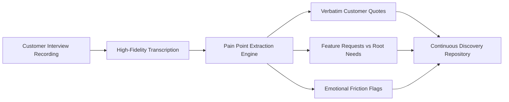

Product Managers (PMs) spend an estimated 15 to 25 hours every week in meetings. Between customer discovery interviews, engineering grooming sessions, executive roadmap reviews, and cross-functional syncs, the PM is the central information router of a technology organization.

Yet the administrative tax of this role is staggering. 

When a PM is furiously scribbling notes during a customer interview, they lose the ability to observe body language, probe unexpected comments, or practice deep active listening. After the call, those rough notes frequently sit in unstructured Google Docs, forcing the PM to spend their evenings manually synthesizing feedback into Product Requirement Documents (PRDs) and Jira epics.

Deploying specialized meeting intelligence transforms how product leaders operate. Rather than acting as clerical scribes, PMs can engage fully in conversations while relying on automated pipelines to extract structured insights.

This guide outlines practical workflows for applying AI meeting documentation across the three most critical product management rituals: **User Research Discovery**, **PRD Scoping**, and **Sprint Retrospectives**.

---

## 1. User Research & Customer Discovery Synthesis

In customer discovery, verbatim phrasing matters immensely. Paraphrasing a customer's frustration through your own cognitive bias often masks the root problem.



### The Discovery Extraction Framework
When analyzing user research interviews, configure your AI extraction prompts around three specific qualitative vectors:

1. **The Root Friction:** What specific workflow step provoked frustration or caused the user to switch to a workaround?
2. **The Economic Impact:** Did the user quantify lost time, wasted budget, or missed conversion metrics?
3. **Verbatim Anchor Quotes:** Unaltered statements that can be directly pasted into slide decks to build executive empathy.

#### Example Structured Discovery Output:
```markdown
### Customer Discovery: Enterprise Workflow Lead
* **Participant:** Sarah Lin (Director of Operations, HealthTech Corp)
* **Core Friction:** Multi-step CSV reconciliation between billing and EHR systems.
* **Quantified Impact:** "My analysts spend roughly 14 hours every Monday reconciling invoices before we can run payroll."
* **Anchor Quote:** *"We don't need another dashboard; we just need a script that screams when a reconciliation line fails."*
* **Candidate Requirement:** Automated discrepancy alerting via webhook.
```

---

## 2. Converting Architectural Kickoffs into PRD Scaffolding

Writing a comprehensive Product Requirement Document (PRD) typically takes several hours of synthesis following an engineering kickoff. 

By structuring meeting notes with strict entity extraction, PMs can convert a 45-minute discussion directly into PRD draft components:

| PRD Component | Conversational Source in Meeting | AI Extraction Filter |
| :--- | :--- | :--- |
| **Problem Statement** | Early meeting discussion of customer tickets or outages | Isolate initial problem framing tokens |
| **User Stories** | Discussion of how end users interact with the proposed solution | Transform spoken scenarios into standard "As a... I want... So that..." syntax |
| **Technical Constraints** | Engineering feedback regarding latency, databases, or API ceilings | Extract explicit architecture boundaries and dependency blockers |
| **Out of Scope** | Features intentionally postponed or rejected during debate | Identify negations ("Let's not build that for V1") |
| **Success Metrics** | Targets proposed by commercial or operational stakeholders | Extract quantitative KPIs discussed during the session |

### The "Out of Scope" Protection Protocol
One of the most dangerous points of failure in product delivery is scope creep. During planning calls, ideas are frequently discussed and subsequently deferred. 

A standard generic note-taker often mistakenly includes deferred ideas as deliverables. In MeetMind AI, defensive system prompts cross-check early suggestions against concluding decisions:

```
Rule: If a feature proposal was contested or deferred later in the transcript, 
explicitly record it under "Out of Scope for V1" with the stated technical justification.
```

---

## 3. Sprint Reviews and Agile Retrospectives

Agile retrospectives frequently suffer from "recency bias"—teams focus exclusively on whatever broke in the last 48 hours while forgetting operational impediments from two weeks prior.

By maintaining structured meeting logs across daily standups and sprint reviews, PMs can query meeting history to identify systemic friction:

```markdown
## Sprint 42 Retrospective Extraction
* **Completed Commitments:** 14 / 16 Story Points delivered on schedule.
* **Unplanned Blockers:** Third-party OAuth certificate expiration on Tuesday morning delayed mobile QA by 1.5 days.
* **Process Experiment:** Implement automated certificate renewal monitoring in Datadog before Sprint 43 kickoff.
* **Action Item:** Marcus (DevOps) to configure Datadog TLS monitors by Thursday at 5:00 PM.
```

---

## 4. Efficiency Comparison: Manual vs. AI-Assisted PM Workflows

| Operational Activity | Traditional Manual Workflow | AI-Assisted Workflow with MeetMind AI | Time Reclaimed |
| :--- | :--- | :--- | :--- |
| **Customer Interview Analysis** | 45 min listening + 30 min note consolidation | 45 min active listening + 3 min review | **~27 minutes per call** |
| **PRD Draft Generation** | 2 to 3 hours drafting from scratch | 20 minutes refining structured transcript output | **~1.5 to 2 hours per feature** |
| **Sprint Backlog Ticket Creation** | 45 minutes copying tasks to Jira | 5 minutes exporting JSON action items | **~40 minutes per sprint** |
| **Stakeholder Alignment Updates** | 30 minutes drafting recap emails | 2 minutes editing executive summary | **~28 minutes per update** |

---

---

## 5. Cross-Functional Stakeholder Alignment & Asynchronous Updates

A major hidden drain on product management velocity is the recurring demand for status updates from executive stakeholders, sales engineers, and customer success leads. When non-technical executives cannot attend a 45-minute technical roadmap grooming call, they rely on the PM to synthesize high-level outcomes.

By utilizing MeetMind AI's structured executive extraction, PMs can distribute tiered communication:
* **For Engineering Leads:** Full technical action items with Jira keys, API endpoint specs, and transcript timestamps.
* **For Commercial & Sales Leaders:** A 3-bullet executive summary highlighting feature release timelines, customer-facing capabilities, and unblockers.
* **For Design & UX:** Verbatim customer sentiment quotes and usability friction markers extracted directly from user discovery calls.

This tiered distribution eliminates manual email drafting and ensures organizational alignment without scheduling additional catch-up meetings.

---

## 6. Compliance & Ethics in User Research Recording

Product managers frequently handle sensitive feedback under Non-Disclosure Agreements (NDAs). When implementing automated meeting intelligence for research:

1. **Obtain Explicit Recording Consent:** Always include recording disclaimers in research scheduling emails (e.g. via Calendly or SavvyCal).
2. **Anonymize Competitor References:** If an enterprise customer reveals confidential contract details or pricing from an existing vendor, redact those numerical figures before circulating summaries internally.
3. **Use Ephemeral Processing Architectures:** Ensure customer voice recordings are processed on zero-retention infrastructure like MeetMind AI, where raw audio is unlinked from server memory immediately after transcription.

---

## Conclusion

Product management requires synthesizing messy, qualitative human communication into structured, logical technical roadmaps. By automating transcript extraction, PRD scaffolding, and action-item tracking, PMs can reclaim cognitive capacity to focus on what matters most: talking to users and building products people love.
