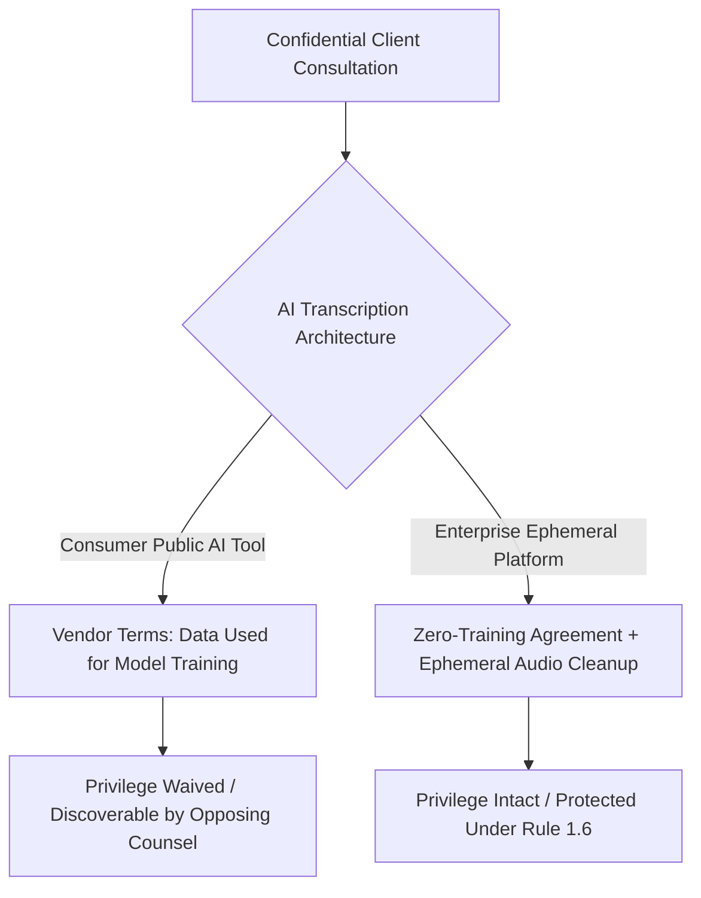

The legal profession runs on the precision of the spoken word. From multi-day witness depositions and settlement negotiations to sensitive client intake consultations and partner strategy sessions, oral testimony shapes legal strategy and litigation outcomes.

Historically, capturing these conversations required human court reporters or specialized legal transcription services charging $3.00 to $6.00 per audio minute with multi-day turnaround times. 

While automated speech-to-text (ASR) technology offers instant turnaround and dramatic cost reductions, law firms operate under unique professional and ethical constraints. 

Inadvertently routing a confidential client interview through a consumer AI platform that trains public models or permits human vendor auditing can trigger catastrophic legal consequences: **the waiver of attorney-client privilege**, violations of **ABA Model Rules of Professional Conduct (Rule 1.6)**, and exposure under civil discovery rules.

This guide analyzes how modern law firms can safely leverage AI transcription for internal strategy and preliminary deposition review while maintaining bulletproof confidentiality.

---

## 1. Protecting Attorney-Client Privilege Under FRE 502

The attorney-client privilege protects confidential communications made between an attorney and a client for the purpose of seeking legal advice. 

Under US Federal Rule of Evidence (FRE) 502 and state equivalents, voluntary disclosure of privileged communication to an unauthorized third party generally waives the privilege.



### The Three Critical Vendor Traps:
1. **Public Model Training:** If an AI provider's Terms of Service state that prompts or audio files may be used to train or fine-tune neural network weights, your client's statements may be reproduced in subsequent model completions—destroying confidentiality.
2. **Human Quality Audits:** Consumer services frequently reserve the right for contractors or employees to review audio clips for "quality assurance." Exposing client voice recordings to third-party human listeners is a direct breach of privilege.
3. **Data Retention in Third-Party Cloud Buckets:** Leaving unencrypted audio files on third-party servers creates an ongoing subpoena target for opposing counsel in civil litigation.

---

## 2. Certified Court Reporting vs. AI Preliminary Transcripts

In civil and criminal litigation, legal teams must distinguish between **certified court transcripts** and **preliminary operational transcripts**:

| Dimension | Certified Court Reporter Transcript | AI Preliminary Transcript (MeetMind AI) |
| :--- | :--- | :--- |
| **Primary Use Case** | Official trial exhibits, judicial filings, formal appeals | Same-day case assessment, witness prep, motion drafting |
| **Turnaround Time** | 3 to 14 business days | 2 to 5 minutes following session conclusion |
| **Cost Structure** | $3.50 to $8.00+ per page | Flat subscription or fractions of a cent per minute |
| **Legal Admissibility** | Presumed accurate under Federal Rules of Civil Procedure | Work-product draft; requires independent verification |
| **Speaker Diarization** | Human-verified speaker identification | Automated acoustic diarization (human review recommended) |

### The Strategic Value of "Same-Day Roughs"
Litigators do not use AI transcription to replace certified stenographers during trial testimony. 

Instead, firms deploy AI tools to generate immediate working transcripts after 7-hour depositions. Rather than waiting two weeks for certified transcripts, trial teams can analyze witness testimony the same evening, cross-reference contradictions against prior disclosures, and draft subsequent examination questions before the next morning's deposition begins.

---

## 3. The Work-Product Doctrine and AI Summaries

Under Federal Rule of Civil Procedure 26(b)(3), the **Work-Product Doctrine** protects documents and tangible things prepared in anticipation of litigation by or for an attorney.

When an attorney uses MeetMind AI to extract:
* Categorized inconsistencies in witness testimony
* Key timelines and monetary estimates
* Chronological decision logs

These derivative documents are classic attorney work product. Because the AI model acts under the attorney's direction and prompting criteria, the resulting summaries reflect legal analysis and strategy.

To ensure work-product protections remain enforceable:
1. Maintain strict user access controls: Transcripts and summaries must be restricted to the immediate legal team via Row-Level Security (RLS).
2. Apply standard confidentiality headers: Automated exports should automatically embed legal warning headers:
   `"ATTORNEY WORK PRODUCT // PRIVILEGED AND CONFIDENTIAL"`

---

## 4. Engineering Architecture for Legal Compliance

MeetMind AI's architecture is engineered around the security prerequisites demanded by law firm IT committees:

```
[Uploaded Audio] ---> [TLS 1.2+ Transit] ---> [Ephemeral Disk Allocation]
                                                        |
                                                        v
                                             [ASR Transcription]
                                                        |
                                                        v
                                          [os.unlink() Hard Cleanup]
                                                        |
                                                        v
                          [Encrypted Supabase PostgreSQL (AES-256 at Rest)]
```

### Key Security Safeguards:
* **Zero Model Training:** MeetMind AI operates under commercial API agreements ensuring customer transcripts are never used for model training or weight adjustments.
* **Ephemeral Audio Storage:** Raw audio recordings are streamed to temporary local disk solely for processing and unlinked immediately after transcription in an automated `finally` block.
* **Row-Level Security (RLS):** Every database row is cryptographically bound to the individual attorney's authenticated account, preventing cross-matter or cross-tenant data access.

---

---

## 5. Legal Hold Compliance and E-Discovery Integration

In modern corporate litigation, parties are subject to immediate **legal preservation holds** once litigation is reasonably anticipated. Under Federal Rule of Civil Procedure 37(e), the failure to preserve discoverable Electronically Stored Information (ESI)—including meeting recordings, transcripts, and internal chat messages—can lead to severe evidentiary sanctions.

When integrating AI transcription into e-discovery workflows:
* **Exporting to Litigation Platforms:** MeetMind AI provides standardized, unformatted text and structured JSON exports designed for ingestion into document review platforms like **Relativity**, **Everlaw**, and **Disco**.
* **Preserving Verbatim Metadata:** Transcripts retain precise timestamps and speaker labels, enabling litigation support specialists to correlate witness statements directly against exhibits and deposition video clips.
* **Audit-Proof Defensibility:** Because raw audio is unlinked following transcription while transcripts remain cryptographically sealed under user-isolated PostgreSQL RLS, legal teams can establish an uncompromised chain of custody.

---

## 6. Law Firm Implementation Checklist

Before deploying automated transcription across litigation or transactional practices, law firms should enforce the following operational checklist:

1. **Verify State Wiretapping Laws:** Ensure client engagement agreements contain explicit consent clauses for recorded interviews and video conference capture.
2. **Review Outside Counsel Guidelines (OCGs):** Enterprise corporate clients frequently stipulate specific cloud storage restrictions. Confirm that AI transcription tools comply with client vendor management requirements.
3. **Conduct Human Verification of Proper Nouns:** ASR models occasionally struggle with rare Latin legal maxims (e.g. *res ipsa loquitur*) or unusual corporate entity names. Legal assistants should review transcripts to verify proper noun spelling before filing working drafts.
4. **Enforce Two-Factor Authentication (2FA):** Protect firm accounts with mandatory hardware security keys or authenticator apps to prevent unauthorized credential access.

---

## Conclusion

AI transcription is transforming legal operations—slashing the delay between spoken testimony and actionable trial strategy. By deploying platforms engineered with zero-training agreements, ephemeral audio handling, and rigorous database encryption, law firms can embrace the velocity of modern AI without jeopardizing client privilege or professional ethics.
