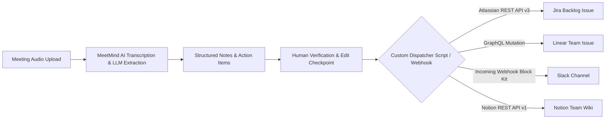

In software engineering organizations, sprint planning meetings, architectural reviews, and post-mortems generate high-value operational commitments. Yet the bridge between verbal commitments and issue trackers remains overwhelmingly manual. 

Developers and engineering managers routinely spend 30 to 45 minutes following every major session copying discussion snippets, formatting user stories, assigning ticket owners, and creating backlog issues across Jira or Linear.

When this workflow is executed manually, critical technical nuances are frequently lost:
* Verbal acceptance criteria discussed during the call fail to make it into the ticket description.
* Tasks are assigned without linking back to the transcript timestamp where architectural trade-offs were debated.
* Duplicate or contradictory tasks are opened across different sprint backlogs.

This guide details a technical blueprint for converting structured meeting outputs into automated, idempotent issue creation across **Jira Software (REST API v3)** and **Linear (GraphQL API)**.

> **Architecture Disclosure:** MeetMind AI does **not** feature direct, automated push integrations, OAuth app bots, or marketplace apps for Jira, Linear, Slack, Notion, or Zapier. MeetMind AI generates structured Markdown summaries, key decision lists, and action items available for instant copy or `.md`/`.txt` export. The workflows detailed below demonstrate how engineering teams can write custom developer scripts and webhooks to consume these structured meeting outputs and route tasks into their issue tracking and collaboration stacks.

---

## 1. Pipeline Architecture Overview

Rather than relying on closed, black-box integrations that blindly blast unverified tickets into your backlog, a resilient engineering pipeline employs a staged workflow:



### Core Design Principles
1. **Human Verification Gate:** Automated systems should propose tickets, not unilaterally publish them. A review step allows project managers or tech leads to adjust estimates and assignee mappings before dispatching API requests.
2. **Deterministic Schemas:** Downstream automation requires predictable data structures. MeetMind AI structures summaries into explicit sections: Executive Summary, Key Decisions, Action Items, and Next Steps.
3. **Idempotent Ingestion:** Re-running a processing script on the same meeting notes must update existing tickets or terminate cleanly rather than spawning duplicate issues.

---

## 2. The Structured Action Item Data Model

Whether extracted programmatically from API responses or parsed from exported Markdown/text task lists, automated ticket dispatching requires mapping tasks into a clean entity specification:

```json
{
  "meeting_id": "mtg_94827104",
  "meeting_title": "Q3 Backend Architecture Review",
  "timestamp": "2026-08-24T14:30:00Z",
  "action_items": [
    {
      "task_id": "act_01",
      "title": "Migrate session caching from Redis Standalone to Redis Cluster",
      "description": "Implement cluster mode in redis_client.py to support horizontal scaling ahead of load testing.",
      "assignee_name": "Marcus Vance",
      "suggested_priority": "High",
      "acceptance_criteria": [
        "Enable cluster routing in redis configuration",
        "Pass end-to-end integration test suite under cluster failover"
      ],
      "context_quote": "Marcus: I can handle the Redis cluster client migration by Wednesday before we start load tests."
    }
  ]
}
```

---

## 3. Integrating with Jira Software (REST API v3)

Jira Software uses Atlassian Document Format (ADF) for its v3 REST API descriptions. Below is a production-ready Node.js integration script that reads verified meeting action items and creates backlog issues.

```javascript
/**
 * jira_sync.js - Dispatch meeting action items to Jira Software REST API v3
 */
const axios = require('axios');

const JIRA_DOMAIN = process.env.JIRA_DOMAIN; // e.g. "yourcompany.atlassian.net"
const JIRA_EMAIL = process.env.JIRA_EMAIL;
const JIRA_API_TOKEN = process.env.JIRA_API_TOKEN;
const JIRA_PROJECT_KEY = process.env.JIRA_PROJECT_KEY || 'ENG';

const authHeader = Buffer.from(`${JIRA_EMAIL}:${JIRA_API_TOKEN}`).toString('base64');

async function createJiraIssue(actionItem, meetingTitle) {
  // Construct description in Atlassian Document Format (ADF)
  const adfDescription = {
    version: 1,
    type: 'doc',
    content: [
      {
        type: 'paragraph',
        content: [{ type: 'text', text: actionItem.description }]
      },
      {
        type: 'heading',
        attrs: { level: 3 },
        content: [{ type: 'text', text: 'Acceptance Criteria' }]
      },
      {
        type: 'bulletList',
        content: actionItem.acceptance_criteria.map(criterion => ({
          type: 'listItem',
          content: [
            {
              type: 'paragraph',
              content: [{ type: 'text', text: criterion }]
            }
          ]
        }))
      },
      {
        type: 'paragraph',
        content: [
          { type: 'text', text: 'Origin: ', marks: [{ type: 'strong' }] },
          { type: 'text', text: meetingTitle }
        ]
      },
      {
        type: 'blockquote',
        content: [
          {
            type: 'paragraph',
            content: [{ type: 'text', text: actionItem.context_quote }]
          }
        ]
      }
    ]
  };

  const payload = {
    fields: {
      project: { key: JIRA_PROJECT_KEY },
      summary: `[Meeting] ${actionItem.title}`,
      description: adfDescription,
      issuetype: { name: 'Task' },
      labels: ['meetmind-ai', 'automated-task']
    }
  };

  try {
    const response = await axios.post(
      `https://${JIRA_DOMAIN}/rest/api/3/issue`,
      payload,
      {
        headers: {
          'Authorization': `Basic ${authHeader}`,
          'Content-Type': 'application/json',
          'Accept': 'application/json'
        }
      }
    );
    console.log(`Successfully created Jira issue: ${response.data.key}`);
    return response.data;
  } catch (error) {
    console.error('Failed to create Jira issue:', error.response ? error.response.data : error.message);
    throw error;
  }
}
```

---

## 4. Integrating with Linear (GraphQL API)

Linear provides an elegant GraphQL API that allows rapid creation of issues with milestone and team resolution. Below is a Python script leveraging the `requests` library to dispatch action items into Linear.

```python
"""
linear_sync.py - Sync structured meeting action items to Linear via GraphQL
"""
import os
import requests

LINEAR_API_URL = "https://api.linear.app/graphql"
LINEAR_API_KEY = os.environ.get("LINEAR_API_KEY")
LINEAR_TEAM_ID = os.environ.get("LINEAR_TEAM_ID")  # UUID of target engineering team

def create_linear_issue(action_item, meeting_title):
    headers = {
        "Content-Type": "application/json",
        "Authorization": LINEAR_API_KEY
    }

    # Format Markdown description body
    criteria_lines = "\n".join([f"- [ ] {item}" for item in action_item.get("acceptance_criteria", [])])
    
    description_markdown = (
        f"{action_item['description']}\n\n"
        f"### Acceptance Criteria\n{criteria_lines}\n\n"
        f"---\n"
        f"**Source Meeting:** {meeting_title}\n"
        f"> *\"{action_item['context_quote']}\"*"
    )

    # Priority mapping: High -> 2, Medium -> 3, Low -> 4
    priority_map = {"Urgent": 1, "High": 2, "Medium": 3, "Low": 4}
    priority_value = priority_map.get(action_item.get("suggested_priority"), 3)

    mutation = """
    mutation IssueCreate($input: IssueCreateInput!) {
      issueCreate(input: $input) {
        success
        issue {
          id
          identifier
          title
          url
        }
      }
    }
    """

    variables = {
        "input": {
            "teamId": LINEAR_TEAM_ID,
            "title": f"[Meeting] {action_item['title']}",
            "description": description_markdown,
            "priority": priority_value,
            "labels": ["Meeting Action"]
        }
    }

    response = requests.post(
        LINEAR_API_URL,
        json={"query": mutation, "variables": variables},
        headers=headers,
        timeout=10
    )

    data = response.json()
    if "errors" in data:
        raise RuntimeError(f"Linear GraphQL Error: {data['errors']}")

    created_issue = data["data"]["issueCreate"]["issue"]
    print(f"Created Linear issue {created_issue['identifier']}: {created_issue['url']}")
    return created_issue
```

---

## 5. Broadcasting Summaries to Slack via Block Kit Webhooks

For team-wide transparency, meeting summaries and priority tasks can be broadcast to relevant channels using Slack's incoming webhook service with Block Kit:

```javascript
/**
 * slack_meeting_notifier.js - Dispatch meeting summaries to a Slack channel
 */
const axios = require('axios');

const SLACK_WEBHOOK_URL = process.env.SLACK_WEBHOOK_URL;

async function postMeetingToSlack(meetingData) {
  const actionItemLines = (meetingData.action_items || []).map(item => (
    `• *${item.assignee_name || 'Unassigned'}*: ${item.title}`
  )).join('\n');

  const payload = {
    blocks: [
      {
        type: 'header',
        text: {
          type: 'plain_text',
          text: `📋 Meeting Summary: ${meetingData.meeting_title}`,
          emoji: true
        }
      },
      {
        type: 'section',
        text: {
          type: 'mrkdwn',
          text: `*Action Items:*\n${actionItemLines || 'No explicit action items assigned.'}`
        }
      },
      {
        type: 'context',
        elements: [
          {
            type: 'mrkdwn',
            text: '⚡ Transcribed & summarized via MeetMind AI | Verified by Team Lead'
          }
        ]
      }
    ]
  };

  await axios.post(SLACK_WEBHOOK_URL, payload);
  console.log('Successfully posted summary to Slack');
}
```

---

## 6. Syncing Meeting Notes to Notion Databases

To maintain an organizational knowledge base, meeting summaries and action items can be appended directly to a Notion database using the Notion REST API:

```python
"""
notion_meeting_sync.py - Sync meeting records to an enterprise Notion database
"""
import os
import requests

NOTION_API_KEY = os.environ.get("NOTION_API_KEY")
NOTION_DATABASE_ID = os.environ.get("NOTION_DATABASE_ID")

def sync_to_notion(meeting_title, executive_summary, decisions):
    headers = {
        "Authorization": f"Bearer {NOTION_API_KEY}",
        "Content-Type": "application/json",
        "Notion-Version": "2022-06-28"
    }

    payload = {
        "parent": {"database_id": NOTION_DATABASE_ID},
        "properties": {
            "Meeting Title": {
                "title": [{"text": {"content": meeting_title}}]
            }
        },
        "children": [
            {
                "object": "block",
                "type": "heading_2",
                "heading_2": {
                    "rich_text": [{"type": "text", "text": {"content": "Executive Summary"}}]
                }
            },
            {
                "object": "block",
                "type": "paragraph",
                "paragraph": {
                    "rich_text": [{"type": "text", "text": {"content": executive_summary}}]
                }
            }
        ]
    }

    res = requests.post("https://api.notion.com/v1/pages", json=payload, headers=headers, timeout=10)
    res.raise_for_status()
    print("Created Notion page:", res.json()["url"])
```

---

## 7. Architectural Comparison: Jira vs. Linear vs. Slack vs. Notion Integration

When choosing how to automate your meeting issue pipeline, operational requirements dictate the optimal path:

| Feature Dimension | Jira Software (REST v3) | Linear (GraphQL API) |
| :--- | :--- | :--- |
| **API Protocol** | REST with JSON / ADF Schema | GraphQL (Single Endpoint) |
| **Description Formatting** | Atlassian Document Format (Structured AST) | Native GitHub-Flavored Markdown |
| **Authentication** | HTTP Basic (Email + API Token) | Bearer API Key or Personal Access Token |
| **Payload Complexity** | High (Deeply nested JSON structure) | Low (Clean key-value variables) |
| **Rate Limiting** | Dynamic per-tenant throttling | 1,440 requests per hour per user |
| **Team/Project Discovery** | Requires multi-stage metadata calls | Direct schema querying in single round-trip |

---

## 6. Key Enterprise Safeguards

Deploying automated ticket creation in production teams requires defensive engineering to prevent spam and maintain organizational trust:

### 1. User Disambiguation
Meeting transcripts record spoken first names (e.g. "Alex said he'd handle the documentation"). In enterprise environments with five individuals named Alex, an automated pipeline must maintain an internal mapping table:

```json
{
  "alex_g": "usr_alex_green_jira_id",
  "alex_m": "usr_alex_martinez_jira_id"
}
```

If an assignee cannot be resolved with 100% confidence, the ticket must be flagged as `Unassigned` to prevent alerting the wrong team member.

### 2. Idempotency Keys
To prevent duplicate ticket generation when reviewing or re-exporting notes, compute an idempotency hash derived from the meeting ID and task title:

```python
import hashlib

def generate_task_hash(meeting_id, task_title):
    raw_key = f"{meeting_id}:{task_title.strip().lower()}"
    return hashlib.sha256(raw_key.encode('utf-8')).hexdigest()[:16]
```

Store this hash in Jira's custom field or Linear's external metadata. Before creating an issue, query for the existing hash; if found, log a no-op and continue.

### 3. Transcript Traceability
Every generated issue should preserve the verbatim quote and source timestamp. When engineers pick up the ticket days later, having immediate access to the exact conversational context reduces ambiguity and prevents unnecessary follow-up meetings.

---

## Conclusion

Automating the handover between conversation and execution eliminates one of the most persistent operational taxes in remote engineering teams. By combining MeetMind AI's structured transcript extraction with resilient API scripts, organizations can ensure that decisions made in the conference room translate seamlessly into backlog momentum—with zero dropped commitments.
