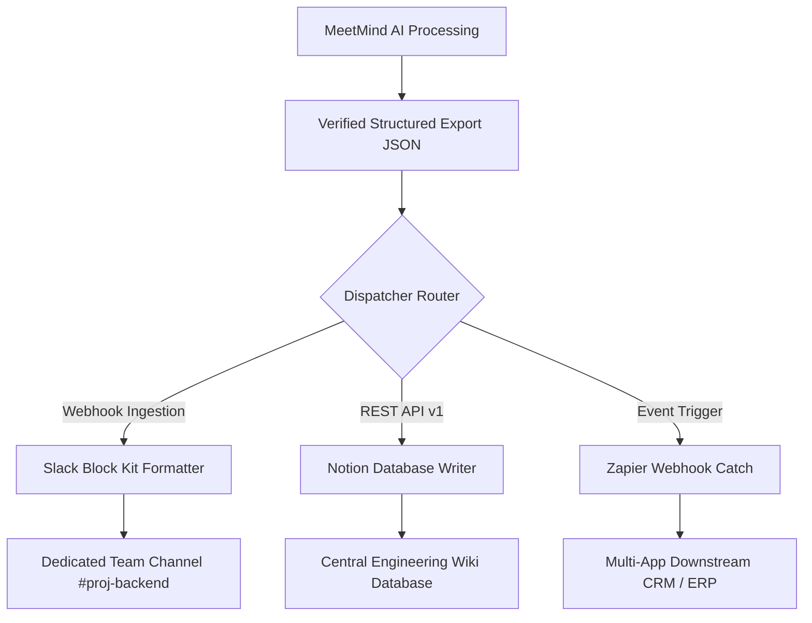

Generating an accurate meeting summary is only half the battle in modern organization design. The true bottleneck lies in distribution: ensuring that critical decisions, deadlines, and assigned deliverables land where teams actually execute their daily work.

If meeting notes remain trapped in a specialized recording tool, visibility plummets. Team members forget to check external links, action items slip through the cracks, and asynchronous contributors lose alignment.

Conversely, manual copy-pasting into project documentation consumes hours of high-value engineering and management time.

This guide provides an engineering blueprint for routing structured meeting notes into three foundational collaboration environments:
1. **Slack:** Broadcasting executive summaries and priority alerts via incoming webhooks and Slack Block Kit.
2. **Notion:** Appending structured records to centralized team knowledge bases using the Notion REST API.
3. **Zapier:** Triggering multi-step enterprise workflows using webhook payloads.

> **Architecture Disclosure:** MeetMind AI does **not** provide direct, native, automated push integrations or OAuth app bots for Slack, Notion, or Zapier. MeetMind AI is designed as a focused audio-to-intelligence tool that exports structured Markdown, TXT, and JSON. The integration patterns documented below are developer-managed pipelines that consume these exported files.

---

## 1. Architectural Distribution Pipeline

Rather than broadcasting raw text dumps that clutter team channels, automated distribution requires parsing structured JSON data into specialized layout contracts:



### Key Integration Boundaries
* **Information Density:** Slack messages must prioritize brevity—executive summaries and high-priority action items only.
* **Long-Term Retrieval:** Notion pages must store comprehensive transcripts, participant metadata, and categorized decision logs for historical search.
* **Event Dispatching:** Zapier webhooks must transmit typed, flat key-value pairs to simplify downstream multi-app branching.

---

## 2. Pushing Structured Summaries to Slack via Block Kit

Slack incoming webhooks allow systems to post rich messages formatted using Slack's Block Kit UI framework. Below is a lightweight Node.js script that converts a MeetMind AI export into an elegant, scannable Slack broadcast.

```javascript
/**
 * slack_meeting_notifier.js
 * Formats and dispatches structured meeting summaries to Slack
 */
const axios = require('axios');

const SLACK_WEBHOOK_URL = process.env.SLACK_WEBHOOK_URL;

async function postMeetingToSlack(meetingData) {
  // Format action items into clean markdown blocks
  const actionItemLines = meetingData.action_items.map(item => (
    `• *${item.assignee || 'Unassigned'}*: ${item.task} (Due: _${item.deadline || 'TBD'}_)`
  )).join('\n');

  const payload = {
    blocks: [
      {
        type: 'header',
        text: {
          type: 'plain_text',
          text: `📋 Meeting Summary: ${meetingData.title}`,
          emoji: true
        }
      },
      {
        type: 'section',
        fields: [
          {
            type: 'mrkdwn',
            text: `*Date:* ${meetingData.date}`
          },
          {
            type: 'mrkdwn',
            text: `*Duration:* ${meetingData.duration_minutes} minutes`
          }
        ]
      },
      {
        type: 'divider'
      },
      {
        type: 'section',
        text: {
          type: 'mrkdwn',
          text: `*Executive Summary:*\n${meetingData.executive_summary}`
        }
      },
      {
        type: 'section',
        text: {
          type: 'mrkdwn',
          text: `*Action Items:*\n${actionItemLines || 'No explicit action items assigned.'}`
        }
      },
      {
        type: 'context',
        elements: [
          {
            type: 'mrkdwn',
            text: '⚡ Generated via MeetMind AI | Verified by Project Lead'
          }
        ]
      }
    ]
  };

  try {
    const response = await axios.post(SLACK_WEBHOOK_URL, payload);
    console.log('Successfully posted summary to Slack:', response.statusText);
  } catch (error) {
    console.error('Slack webhook dispatch failed:', error.message);
    throw error;
  }
}
```

---

## 3. Syncing Meeting Records to Notion Databases

The Notion API (`https://api.notion.com/v1/pages`) allows teams to maintain a structured database of organizational knowledge. Below is a Python script that instantiates a new database page with structured properties and nested rich-text blocks.

```python
"""
notion_meeting_sync.py
Appends structured meeting records to an enterprise Notion database.
"""
import os
import requests

NOTION_API_KEY = os.environ.get("NOTION_API_KEY")
NOTION_DATABASE_ID = os.environ.get("NOTION_DATABASE_ID")

def sync_to_notion(meeting_data):
    headers = {
        "Authorization": f"Bearer {NOTION_API_KEY}",
        "Content-Type": "application/json",
        "Notion-Version": "2022-06-28"
    }

    # Construct Notion page payload
    payload = {
        "parent": {"database_id": NOTION_DATABASE_ID},
        "properties": {
            "Meeting Title": {
                "title": [{"text": {"content": meeting_data["title"]}}]
            },
            "Date": {
                "date": {"start": meeting_data["date"]}
            },
            "Category": {
                "select": {"name": meeting_data.get("category", "General")}
            }
        },
        "children": [
            {
                "object": "block",
                "type": "heading_2",
                "heading_2": {
                    "rich_text": [{"type": "text", "text": {"content": "Executive Summary"}}]
                }
            },
            {
                "object": "block",
                "type": "paragraph",
                "paragraph": {
                    "rich_text": [{"type": "text", "text": {"content": meeting_data["executive_summary"]}}]
                }
            },
            {
                "object": "block",
                "type": "heading_2",
                "heading_2": {
                    "rich_text": [{"type": "text", "text": {"content": "Key Decisions"}}]
                }
            }
        ]
    }

    # Append decision bullet points
    for decision in meeting_data.get("decisions", []):
        payload["children"].append({
            "object": "block",
            "type": "bulleted_list_item",
            "bulleted_list_item": {
                "rich_text": [{"type": "text", "text": {"content": decision}}]
            }
        })

    response = requests.post(
        "https://api.notion.com/v1/pages",
        json=payload,
        headers=headers,
        timeout=10
    )

    if response.status_code != 200:
        raise RuntimeError(f"Notion API Error: {response.text}")

    print("Created Notion page successfully:", response.json()["url"])
    return response.json()
```

---

## 4. Triggering Multi-App Workflows with Zapier Webhooks

For organizations utilizing diverse enterprise software stacks (Salesforce, HubSpot, Asana, Monday.com), Zapier provides the fastest routing mechanism.

```
MeetMind AI Webhook Dispatcher ---> Zapier "Catch Hook" Trigger ---> Multi-Step Zap
                                                                |--> Create Asana Task
                                                                |--> Update HubSpot Deal
                                                                |--> Send Follow-up Email
```

### Step 1: Configuring the "Catch Hook" Trigger
1. In Zapier, create a new Zap and select **Webhooks by Zapier** as the trigger event.
2. Select **Catch Hook** and copy the generated webhook URL:
   `https://hooks.zapier.com/hooks/catch/1234567/abcdef/`

### Step 2: Dispatching the Typed Payload
Send a flattened JSON payload containing pre-formatted markdown and discrete fields:

```bash
curl -X POST https://hooks.zapier.com/hooks/catch/1234567/abcdef/ \
  -H "Content-Type: application/json" \
  -d '{
    "event_type": "meeting.processed",
    "meeting_id": "mtg_771829",
    "title": "Client Onboarding: Acme Corp",
    "executive_summary": "Reviewed contract milestones, integration timelines, and security audit sign-offs.",
    "top_action_item": "Send revised BAA agreement to Acme legal team",
    "assignee_email": "rachel@acme.com",
    "client_name": "Acme Corp"
  }'
```

### Step 3: Filtering and Branching in Zapier
By providing typed fields (`client_name`, `event_type`), Zapier Paths can automatically branch:
* If `client_name` exists, update the corresponding CRM record in HubSpot.
* If `top_action_item` exists, generate a calendar reminder for the account manager.

---

## 5. Architectural Comparison: Direct APIs vs. Webhook Middleware

| Architectural Dimension | Direct Slack / Notion API | Zapier Webhook Middleware |
| :--- | :--- | :--- |
| **Development Effort** | Medium (Requires custom Node.js/Python script) | Minimal (No-code graphical interface) |
| **Operational Maintenance** | Low (Direct vendor contracts) | Subscription cost scales with Zap volume |
| **Formatting Flexibility** | High (Complete control over Block Kit / Notion AST) | Limited to template field mapping |
| **Execution Latency** | Near instantaneous (&lt;500ms) | 1 to 15 minutes depending on Zapier tier |
| **Failure Recovery** | Custom retry logic & exponential backoff | Built-in Zapier task replay interface |

---

## 6. Security and Rate-Limit Best Practices

When deploying automated meeting distribution scripts across production environments, ensure these safeguards are implemented:

1. **HMAC Webhook Verification:** Always sign outgoing webhook payloads with a shared secret using HMAC SHA-256. The receiving endpoint verifies the `X-Signature` header to prevent forged requests.
2. **Rate Limiting Defenses:** The Notion API enforces an average limit of 3 requests per second. When syncing large transcripts containing dozens of blocks, batch operations into sequential arrays with a 350-millisecond throttle.
3. **Channel Privacy Isolation:** Never broadcast confidential executive or HR compensation meetings to public Slack channels like `#general`. Ensure your script dynamically resolves target channels based on meeting classification metadata.

---

## Conclusion

By connecting MeetMind AI's structured outputs with Slack, Notion, and Zapier, distributed teams eliminate the friction of manual documentation and ensure organizational knowledge remains instantly actionable across every workspace.
