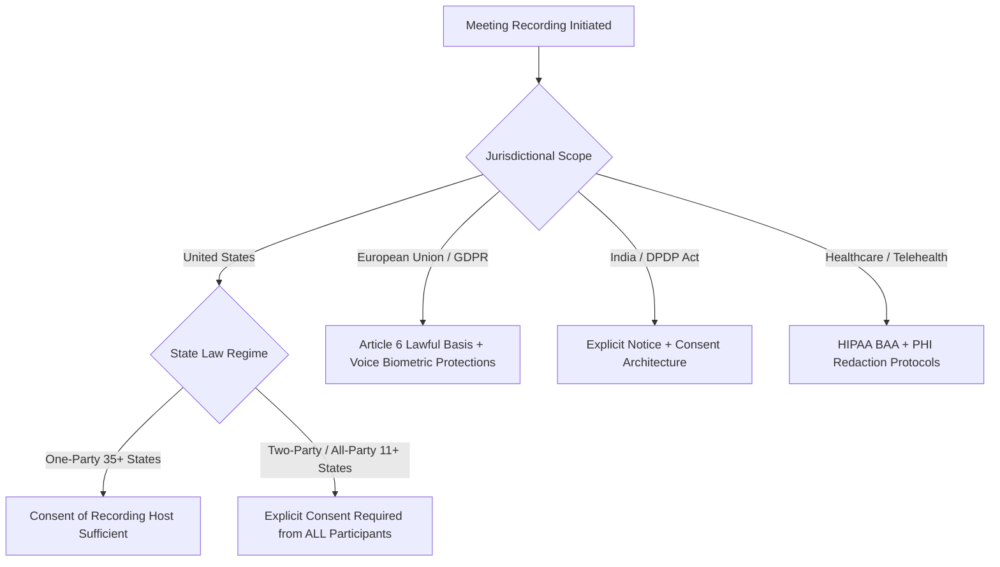
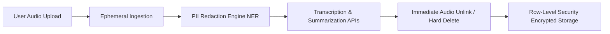

As distributed workforces and video conferencing become permanent fixtures of the global economy, recording business meetings has transitioned from an occasional exception to an everyday operational habit.

However, recording conversations is no longer just a technical question of storage and bandwidth. In 2026, meeting recordings intersect with strict wiretapping statutes, biometric data protections, and regional privacy frameworks. A single recorded Zoom or Google Meet call often spans multiple legal jurisdictions simultaneously—a manager in California, a developer in Germany, and a contractor in India.

When an organization records audio, transcribes it, and routes that text through artificial intelligence models, it creates a chain of legal liabilities under **US Wiretapping Laws**, the **European Union's GDPR**, India's **Digital Personal Data Protection (DPDP) Act**, and healthcare regulations like **HIPAA**.

This guide outlines the legal landscape of recording business calls and provides a concrete engineering checklist for implementing compliant meeting workflows.

---

## 1. The Global Legal Matrix for Call Recording

Recording a conversation without appropriate authorization can result in civil lawsuits, statutory regulatory fines, and in some jurisdictions, criminal misdemeanors. The legal threshold depends fundamentally on consent architecture.



### A. United States: One-Party vs. All-Party Consent
In the United States, federal law (18 U.S.C. § 2511) permits recording conversations provided at least one participant consents ("One-Party Consent"). However, individual state laws frequently supersede federal minimums:

* **One-Party Consent States (Federal baseline and ~35 states):** As long as the person pressing "record" is an active participant in the discussion, no additional permission is legally mandated (e.g., Texas, New York, Virginia).
* **All-Party / Two-Party Consent States (11+ states):** Every participant on the call must give affirmative consent prior to recording. This includes **California, Florida, Illinois, Massachusetts, Maryland, Montana, New Hampshire, Pennsylvania, and Washington**.

> **The Multi-State Trap:** If a host in Texas calls three colleagues in California, courts generally apply the law of the state where the aggrieved party resides. Therefore, in distributed teams, **always default to an all-party consent standard**.

### B. European Union: GDPR & Voice Data
Under the EU General Data Protection Regulation (GDPR), human voice recordings are categorized as **personal data**—and under specific processing conditions, voice prints can be classified as **biometric data** under Article 9:

* **Lawful Basis (Article 6):** Organizations must establish a valid legal ground. In corporate employment contexts, "consent" is often challenged by EU regulators due to the perceived power imbalance between employers and employees. Organizations frequently rely on "Legitimate Interests," provided a formal Data Protection Impact Assessment (DPIA) has been completed.
* **Right to Erasure (Article 17):** If an employee or customer revokes permission or requests data deletion, the organization must possess the technical architecture to delete both the raw audio file and the derivative transcripts.

### C. India: Digital Personal Data Protection (DPDP) Act
India's DPDP Act establishes strict rules for "Data Fiduciaries" collecting digital personal data:
* **Itemized Notice:** Prior to or at the time of recording, participants must receive clear notice detailing the specific purpose of the recording and how derivative AI summaries will be used.
* **Consent Architecture:** Consent must be free, specific, informed, unconditional, and unambiguous. Silence or passive participation does not satisfy affirmative consent under the DPDP Act.

---

## 2. Regulatory Comparison Matrix

| Jurisdiction / Framework | Consent Threshold | Voice Data Classification | Maximum Statutory Penalty |
| :--- | :--- | :--- | :--- |
| **US Federal Law** | One-Party Consent | Standard personal communications | Civil damages + Federal criminal penalties |
| **California (CIPA § 632)** | All-Party Consent | Confidential communication | $5,000 per violation or 3x actual damages |
| **EU GDPR** | Explicit Legal Basis (Art. 6) | Personal data / Potential Biometric (Art. 9) | Up to €20M or 4% of global annual turnover |
| **India DPDP Act (2023)** | Clear Affirmative Consent | Digital personal data | Up to ₹250 Crore (~$30M USD) per violation |
| **HIPAA (US Healthcare)** | Patient Authorization + BAA | Protected Health Information (PHI) | Up to $2,000,000+ per calendar year |

---

## 3. Engineering Architecture for Privacy Compliance

To operate an AI meeting platform like MeetMind AI within global regulatory boundaries, compliance cannot be a retrofitted legal policy—it must be baked into the software architecture.



### 1. The Bot-Free Advantage
Many automated meeting tools force a third-party recording bot to join the Google Meet or Zoom room. If an unannounced bot joins a call with participants from California or Germany who did not receive prior notice, the host is immediately exposed to statutory wiretapping claims.

By operating on an **asynchronous upload model**, MeetMind AI ensures that the user recording the call maintains complete agency over obtaining consent within their own video conferencing tool (e.g. enabling Zoom's native recording announcement disclaimer) before files ever reach our servers.

### 2. Ephemeral Audio Processing
Storing gigabytes of historical employee audio is a massive liability. In MeetMind AI's backend (`backend/app/services/transcription_service.py`), audio is written to a temporary local disk partition solely for ASR chunking:

```python
# Ephemeral Audio Destruction Guarantee
try:
    transcript = await run_transcription_engine(temp_audio_file)
finally:
    if os.path.exists(temp_audio_file):
        os.unlink(temp_audio_file)  # Hard delete raw audio immediately
```

Once transcription completes, the audio is permanently deleted. Derivative text summaries are stored in encrypted databases, minimizing the blast radius in the event of an infrastructure breach.

### 3. Automated PII Redaction Before LLM Transmission
When sending meeting transcripts to large language models for summarization, sensitive identifiers must be sanitized:
* **Financial Data:** Credit card numbers (PCI-DSS) and bank details.
* **Government Identifiers:** Social Security numbers, National IDs.
* **Patient Identifiers:** Medical conditions, dosages, and physician notes (HIPAA).

Using high-speed Named Entity Recognition (NER) models or regex boundary filtering, sensitive tokens should be replaced with placeholder masks (e.g. `[REDACTED_SSN]`) before transmission across external API boundaries.

### 4. Database Row-Level Security (RLS)
Storing meeting transcripts in multi-tenant databases requires rigorous tenant isolation. Using PostgreSQL Row-Level Security via Supabase, every database query is cryptographically constrained to the authenticated user's ID (`auth.uid()`):

```sql
-- Enforce strict tenant isolation on meeting records
CREATE POLICY "Users can only read their own meeting transcripts"
ON public.meetings
FOR SELECT
USING (auth.uid() = user_id);
```

This ensures that even in the case of a front-end vulnerability, cross-tenant data leakage is strictly blocked at the database engine level.

---

## 4. The 5-Point Team Compliance Checklist

Before your engineering or operations team enables meeting recording workflows, enforce this five-point protocol:

1. **Enable Native Platform Disclaimers:** Ensure your video conferencing software (Zoom, Teams, Meet) plays an automated audio announcement whenever recording begins: *"Recording has started."*
2. **Include Consent in Calendar Invites:** Add an explicit notification in the calendar description: *"This session will be recorded and summarized for operational follow-up. Please notify the host if you prefer not to be recorded."*
3. **Establish a Retention Horizon:** Enforce an automated retention policy. Meeting transcripts older than 90 or 180 days should be automatically archived or purged unless marked for permanent compliance holds.
4. **Sign Business Associate Agreements (BAAs):** If your organization handles healthcare information, verify that your transcription and cloud infrastructure providers sign formal HIPAA BAAs before processing patient voice data.
5. **Honor Right-to-Forget Requests:** Ensure your product provides a self-serve "Delete Meeting" button that triggers hard record deletion across all database tables.

---

## Summary

Meeting intelligence tools unlock unprecedented productivity, but regulatory oversight of conversational voice data is expanding rapidly. By implementing clear consent protocols, adopting bot-free asynchronous architectures, and enforcing ephemeral audio destruction, modern organizations can capture the efficiency of AI meeting summaries without compromising on legal compliance.
