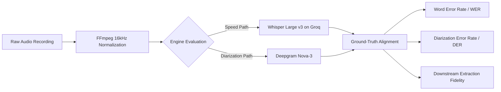

Automated Speech Recognition (ASR) in conversational meetings is fundamentally different from transcribing clean dictation or studio podcasts. In real-world business meetings, participants interrupt each other, speak at varying distances from imperfect laptop microphones, switch between quiet mumbling and enthusiastic agreement, and use domain-specific acronyms.

At MeetMind AI, selecting and tuning our speech-to-text pipeline requires a structured, repeatable evaluation methodology. Rather than relying on generic vendor marketing claims or isolated academic datasets (such as LibriSpeech), we evaluate transcription engines across the messy acoustic realities of real collaboration.

This article outlines our engineering methodology for evaluating automated transcription systems, comparing the strengths and operational constraints of **Whisper** (via Groq LPUs) and **Deepgram Nova-3**, and detailing the testing protocols we use to benchmark transcription quality.

---

## 1. The Dual-Engine Architectural Framework

In MeetMind AI's backend processing pipeline, audio transcription is split into two distinct operational modes based on user requirements:

| Processing Mode | Underlying Engine | Primary Optimization | Key Capabilities |
| :--- | :--- | :--- | :--- |
| **Fast Mode** | OpenAI Whisper Large v3 Turbo (via Groq LPUs) | Raw processing throughput & cost efficiency | Sub-second chunk processing, broad multilingual vocabulary |
| **Meeting Mode** | Deepgram Nova-3 API | Multi-speaker attribution & diarization precision | Word-level timestamps, speaker clustering, filler-word handling |

Each model represents a distinct architectural philosophy. Understanding when and why each engine excels requires testing them against real acoustic variables rather than sterile benchmarks.

---

## 2. Key Acoustic Variables in Meeting Environments

Conversational audio degrades across several well-documented physical and acoustic vectors. Our testing methodology categorizes audio inputs along five primary parameters:

### A. Signal-to-Noise Ratio (SNR) and Room Reverberation
Laptop microphones capture room reflections, HVAC hum, keyboard clatter, and background reverberation. A robust ASR system must maintain token accuracy even when the signal-to-noise ratio drops significantly.

### B. Overlapping Speech and Crosstalk
In collaborative discussions, participants frequently speak simultaneously during debates or agreements. When two voices overlap, single-stream transcription engines often drop one participant entirely, merge words phonetically into hallucinations, or skip the entire overlapping interval.

### C. Speaker Diarization Boundaries
Diarization is the process of answering "who spoke when." A system might transcribe every spoken word with near-zero errors but still fail in practice if it attributes **Speaker A's** objection to **Speaker B**, corrupting subsequent action-item assignment.

### D. Audio Encoding and Sample Rate Normalization
Meeting platforms export audio across varying formats (MP3, WAV, M4A, WebM) and sample rates (from 8 kHz telephone audio to 48 kHz stereo). In MeetMind AI's backend, we run an automated FFmpeg normalization pass:

```bash
# Backend pre-processing pipeline for oversized uploads (>24MB)
ffmpeg -y -i input_meeting.m4a -ar 16000 -ac 1 -b:a 48k normalized_audio.mp3
```

Normalizing inputs to **16 kHz mono** standardizes the acoustic spectrum for ASR ingestion while keeping file sizes compact for rapid API transmission.

---

## 3. Evaluation Metrics and Verification Protocols

When assessing transcription engines, standard automated metrics must be balanced against semantic utility.



### 1. Word Error Rate (WER) with Practical Normalization
WER measures the minimum edit distance (insertions, deletions, substitutions) between an ASR transcript and a human-verified ground-truth transcript:

```
WER = (S + D + I) / N
```

Where:
- **`S`** = Substitutions (incorrect words)
- **`D`** = Deletions (missed words)
- **`I`** = Insertions (hallucinated or extra words)
- **`N`** = Total words in reference transcript

**Methodology Caveat:** Raw WER can penalize a model for differences that carry zero semantic impact—such as transcribing "AI" versus "A.I." or "twenty percent" versus "20%". Our protocol applies text normalization (case folding, number normalization, punctuation stripping) before calculating comparative WER.

### 2. Diarization Error Rate (DER)
For multi-speaker meetings, DER evaluates:
- **Speaker confusion:** Assigning words to the wrong speaker ID.
- **False alarm speech:** Labeling background noise as a speaker.
- **Missed speech:** Failing to detect an active speaker segment.

### 3. Downstream Extraction Utility
Even when an ASR engine exhibits a minor WER deviation, we test whether the downstream Large Language Model (Llama 3.3 70B) extracts the correct tasks, deadlines, and key decisions. Minor phonetic misspellings in casual banter rarely impact business action items, whereas a dropped decimal point in a budget discussion is a critical failure.

---

## 4. Operational Trade-Offs: Whisper vs. Deepgram

Through systematic testing across varied meeting recordings, key architectural trade-offs emerge:

### Whisper Large v3 Turbo (Groq Hosted)
- **Strengths:** Exceptional language modeling priors. Because Whisper is an encoder-decoder transformer trained on vast multilingual datasets, it exhibits high context awareness and correctly infers difficult technical terminology from surrounding context. On Groq LPU hardware, inference latency is near real-time.
- **Constraints:** Native Whisper does not include built-in speaker diarization. To generate speaker turns, audio must either be pre-segmented using an external clustering framework (e.g., PyAnnote) or processed as a single continuous text block. Whisper is also susceptible to repetition hallucination loops during extended periods of ambient background noise or silence.

### Deepgram Nova-3
- **Strengths:** Purpose-built acoustic processing pipeline with native, low-latency speaker diarization. Nova-3 clusters speaker embeddings efficiently, produces clean word-level timestamps, and reliably suppresses non-speech acoustic artifacts without entering repetitive loops.
- **Constraints:** Proprietary cloud API dependency. While highly optimized for conversational English and enterprise terminology, domain-specific slang outside standard corpora may occasionally require custom vocabulary hints.

---

## 5. Testing Best Practices for Engineering Teams

If your engineering organization is evaluating automated transcription models for internal meeting workflows, we recommend the following testing protocol:

1. **Build an Internal Reference Set:** Never rely solely on synthetic or clean audio. Compile 10 to 15 real meeting clips (5–10 minutes each) representing your team's typical recording conditions—remote calls with varying audio quality, hybrid boardroom meetings with reverberation, and fast-paced standups.
2. **Establish Human Ground Truth:** Transcribe reference clips manually with strict timestamp and speaker boundaries to create a verifiable baseline.
3. **Isolate Diarization from Transcription:** Measure word accuracy and speaker attribution independently. An engine that produces perfect words under an unassigned speaker stream requires a different post-processing pipeline than one with native turn-taking.
4. **Implement Ephemeral Processing:** Audio files contain sensitive operational, financial, and personal discussions. MeetMind AI enforces an ephemeral audio handling lifecycle: uploaded audio streams to temporary disk, transcribes through commercial APIs under zero-retention enterprise agreements, and unlinks from local disk immediately upon completion.

---

## Summary

No single speech-to-text model solves every meeting scenario out of the box. By architecting a dual-pipeline approach—leveraging Groq-hosted Whisper for rapid single-speaker transcription and Deepgram Nova-3 for multi-speaker conversational diarization—MeetMind AI provides the flexibility needed to handle diverse audio inputs reliably.

For teams building or implementing meeting intelligence workflows, disciplined empirical testing across real acoustic edge cases remains the only dependable foundation for transcription accuracy.
