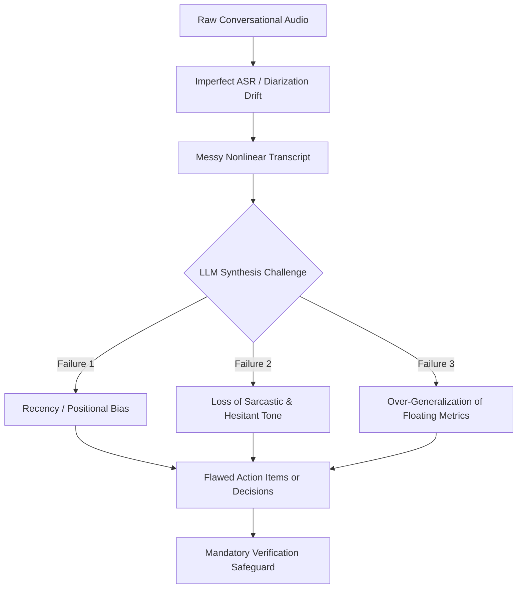

The promise of automated meeting summaries is seductive: upload a recording or drop a bot into a conference call, and receive a pristine distillation of decisions, deadlines, and action items.

In practice, anyone who has deployed generative AI in production environments knows that unstructured conversational transcripts represent one of the most hostile input spaces for Large Language Models (LLMs). Real meetings are nonlinear. Speakers introduce ideas, walk them back five minutes later, interrupt each other, use sarcastic tone, negotiate ambiguous timelines, and imply commitments without explicit grammatical assignments.

At MeetMind AI, our engineering pipeline processes thousands of hours of conversational audio. Rather than treating LLM synthesis as a black box, we continuously study where automated summarization breaks down.

This article examines the primary architectural failure modes of AI meeting summaries, explains the technical root causes, and outlines the defensive prompt engineering and verification protocols we implement to mitigate them.

---

## 1. The Anatomy of Meeting Summarization Failures

When an LLM summarizes a meeting, errors typically fall into four distinct categories:

| Failure Mode | Manifestation | Primary Root Cause | Operational Severity |
| :--- | :--- | :--- | :--- |
| **Premature Consensus** | Recording a proposed idea as an approved decision | Model captures early enthusiasm but fails to register a late objection | **High** (leads to misaligned execution) |
| **Speaker Attribution Bleed** | Assigning an action item to the wrong participant | Diarization drift or shared pronoun usage ("we will handle it") | **Medium–High** (tasks dropped or misallocated) |
| **Implicit Commitment Drop** | Omitting casual commitments ("I'll ping Sarah tomorrow") | Strict instruction filtering that only flags rigid imperative syntax | **Medium** (loss of conversational commitments) |
| **Numeric & Timeline Drift** | Confusing revised launch dates or budget figures | Multiple conflicting values discussed sequentially in the transcript | **Critical** (financial or scheduling error) |

---

## 2. Deep Dive: Why LLMs Hallucinate in Conversational Contexts



### A. The Nonlinear Debate Problem
Unlike structured documentation, a 45-minute architectural review rarely moves in a straight line. 

Consider this common conversational pattern:
1. **Minute 12:** An engineer proposes migrating a microservice database to MongoDB. The team discusses the schema benefits for 10 minutes.
2. **Minute 38:** A principal architect points out compliance blockers with MongoDB in their current regulatory tier. The team agrees to table the migration.

Standard one-pass summarization models frequently record: *"Decision: Team agreed to migrate microservice database to MongoDB."* Because 70% of the token volume around that topic focused on migration benefits, the model's attention mechanism can over-index on the discussion density and ignore the short negation delivered 25 minutes later.

### B. Tone and Intonation Erasure
Speech-to-text models transcribe words, not pitch, cadence, or irony. When a product manager says:
> *"Sure, let's just rewrite the entire checkout frontend before Friday, that won't cause any problems at all."*

The transcript reads as a literal statement of intent. Unless an LLM is explicitly trained or defensively prompted to recognize conversational irony within context, it may output a high-priority action item: *"Action Item: Rewrite checkout frontend by Friday."*

### C. The Floating Numeric Attribution Bug
In budget or performance planning sessions, participants often toss around hypothetical scenarios:
- *"If we scale to 50,000 users, AWS egress will hit $8,000 monthly."*
- *"Right now we're spending $1,200."*
- *"We could optimize down to $950 if we enable caching."*

When an LLM summarizes "Current Infrastructure Spend," it has a documented propensity to extract the highest or most prominent number ($8,000) rather than the actual baseline ($1,200).

---

## 3. Defensive System Design: How MeetMind AI Mitigates Errors

To guard against these failure modes, MeetMind AI does not use unstructured zero-shot prompts. We enforce a defensive processing pipeline designed around strict extraction constraints.

### 1. Enforced JSON Schema Output
Unstructured markdown outputs encourage conversational filler from the model. By enforcing strict JSON schemas (via Pydantic contracts and structured decoding parameters), we force the model to categorize information into explicit entities:

```json
{
  "executive_summary": "High-level contextual summary",
  "key_decisions": [
    {
      "decision": "Concrete agreed action",
      "rationale": "Directly stated justification",
      "context": "Verbatim transcript reference"
    }
  ],
  "action_items": [
    {
      "task": "Explicit assignment",
      "assignee": "Identified participant or Unassigned",
      "deadline": "Stated timeframe or None"
    }
  ]
}
```

### 2. Negative Constraints and Verbatim Grounding
In our system prompts for models like Llama 3.3 70B, we enforce rigorous negative rules:
- **No Extrapolation:** If a deadline is not explicitly voiced, assign `null`. Never estimate "by end of week" from context.
- **Verification of Negations:** Check if any proposal made early in the transcript was explicitly rejected, postponed, or modified later in the text.
- **Explicit Participant Mapping:** If the transcript refers to "we" or "they" without clear speaker resolution, label the task as `Unassigned` rather than guessing an owner based on prior turns.

### 3. Temperature Calibration
Creative generation requires high temperature (`0.7`–`1.0`), but meeting intelligence requires extreme conservatism. MeetMind AI runs summarization queries at **temperature 0.2**, penalizing token variance and maximizing deterministic adherence to the actual transcript.

---

## 4. The Human-in-the-Loop Imperative

No matter how advanced transformer architectures become, automated meeting notes should never be treated as autonomous legal or operational arbiters without human review.

```
AI Output = Accelerated Draft (80% of manual effort eliminated)
Human Review = Authoritative Sign-Off (100% operational accountability)
```

At MeetMind AI, we design our user interface around this reality:
- **Editable Markdown & Action Items:** Users can instantly modify, reassign, or delete extracted tasks before copying or exporting them to Jira, Linear, or Notion.
- **Transparent Audio Playback:** Reviewers can jump directly to corresponding timestamps to verify ambiguous statements directly from the original recording.
- **No Blind Automation:** We deliberately avoid auto-firing tasks into third-party issue trackers without explicit user approval. Meeting commitments should be verified by the people accountable for delivering them.

---

## Conclusion

Automated meeting summarization is a high-leverage productivity capability, but its utility depends entirely on recognizing and defending against its natural failure modes. By understanding the limits of ASR transcription, enforcing strict schema constraints on LLM reasoning, and keeping human review at the center of the workflow, organizations can capture the efficiency of AI without sacrificing operational fidelity.
